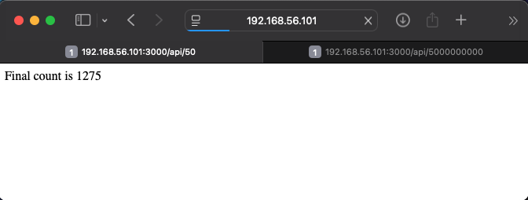
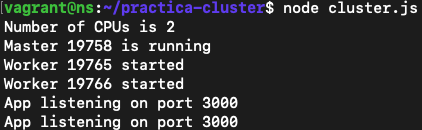
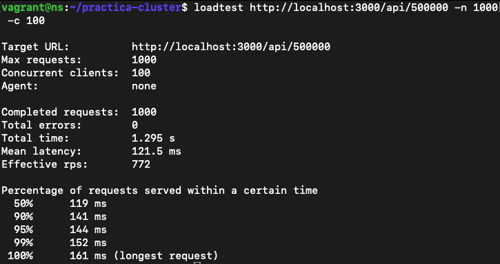
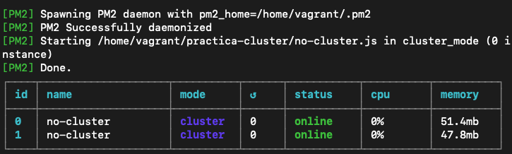
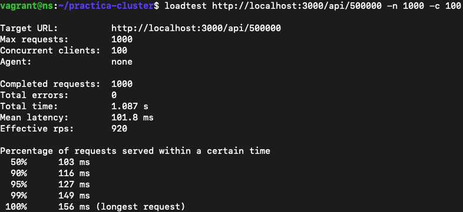
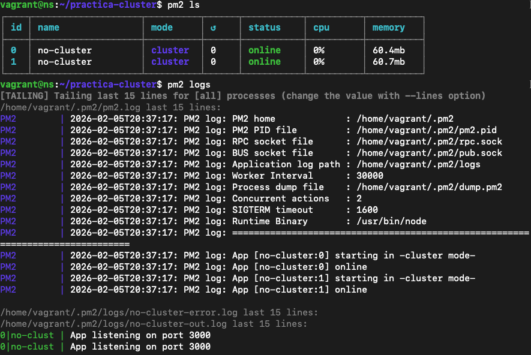
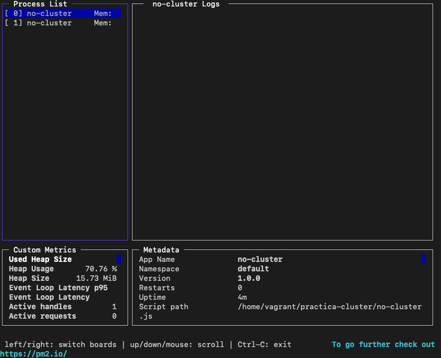
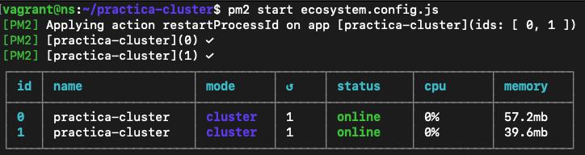

# Práctica: Despliegue de Aplicación en Cluster con Node.js

## Descripción

Práctica de optimización de rendimiento en Node.js utilizando clustering para aprovechar múltiples núcleos de CPU. Se comparan tres enfoques: aplicación sin cluster, con cluster nativo de Node.js, y gestionada con PM2.

---

## Entorno de Desarrollo

- **Sistema Operativo:** Ubuntu/Lunar64 (Vagrant)
- **IP Máquina Virtual:** 192.168.56.101
- **Node.js:** v18.x
- **Puerto:** 3000
- **CPUs disponibles:** 2 núcleos

---

## Instalación y Configuración

### 1. Preparar la Máquina Virtual

```bash
# Iniciar máquina Vagrant
vagrant up
vagrant ssh

# Actualizar e instalar Node.js v18
curl -fsSL https://deb.nodesource.com/setup_18.x | sudo -E bash -
sudo apt-get install -y nodejs

# Verificar instalación
node -v
npm -v
```

### 2. Configurar el Proyecto

```bash
# Crear directorio y proyecto
mkdir practica-cluster
cd practica-cluster
npm init -y

# Instalar dependencias
npm install express

# Instalar herramientas globales
sudo npm install -g loadtest pm2

# Inicializar Git
git init
git add .
git commit -m "Configuración inicial"
```

---

## Desarrollo de la Práctica

### Paso 1: Aplicación Sin Cluster (`no-cluster.js`)

Creamos una aplicación Express básica que ejecuta en un solo proceso y simula operaciones pesadas mediante un bucle de suma.

**Ejecución:**
```bash
node no-cluster.js
```

**Prueba básica:** Accedimos a `http://192.168.56.101:3000/api/50`


*Captura 1: La aplicación responde correctamente mostrando "Final count is 1275"*

---

**Prueba de bloqueo:** Abrimos dos pestañas simultáneamente:
1. Pestaña 1: `http://192.168.56.101:3000/api/5000000000` (operación pesada)
2. Pestaña 2: `http://192.168.56.101:3000/api/50` (operación ligera)


*Captura 2: La pestaña ligera queda bloqueada esperando que termine la pesada*

**Conclusión:** Con un solo proceso, el servidor se bloquea y no puede atender múltiples peticiones simultáneamente.

**Commit realizado:**
```bash
git add .
git commit -m "Implementación versión Sin Cluster (Apartado 2.1)"
```

---

### Paso 2: Aplicación Con Cluster Nativo (`cluster.js`)

Implementamos el módulo `cluster` de Node.js para crear múltiples workers (uno por cada núcleo).

**Ejecución:**
```bash
node cluster.js
```


*Captura 3: Se observan 2 workers iniciados (Number of CPUs is 2), uno por cada núcleo disponible*

---

**Prueba de no-bloqueo:** Repetimos la prueba anterior con dos pestañas simultáneas.


*Captura 4: La pestaña ligera (derecha) responde instantáneamente mientras la pesada (izquierda) sigue procesando*

**Conclusión:** Con cluster, un worker atiende la petición pesada mientras otro worker está libre para atender peticiones ligeras.

**Commit realizado:**
```bash
git add .
git commit -m "Implementación de cluster nativo (Apartado 2.2)"
```

---

### Paso 3: Pruebas de Carga con Loadtest

Instalamos `loadtest` para realizar pruebas de rendimiento científicas:
```bash
sudo npm install -g loadtest
```

#### Prueba 1: Sin Cluster
```bash
loadtest http://localhost:3000/api/500000 -n 1000 -c 100
```


*Captura 5: Resultados sin cluster - 772 RPS, 1.295s total*

---

#### Prueba 2: Con Cluster Nativo
```bash
node cluster.js  # En terminal 1
loadtest http://localhost:3000/api/500000 -n 1000 -c 100  # En terminal 2
```


* Captura 6: Resultados con cluster - 1140 RPS, 0.877s total - ¡47% de mejora!*

---

### Paso 4: Gestión con PM2

Instalamos PM2 para gestionar el cluster automáticamente:
```bash
sudo npm install -g pm2
```

**Iniciamos la aplicación sin cluster en modo cluster con PM2:**
```bash
pm2 start no-cluster.js -i 0
```


*Captura 7: PM2 crea automáticamente 2 instancias en modo cluster*

---

#### Prueba con PM2
```bash
loadtest http://localhost:3000/api/500000 -n 1000 -c 100
```


*Captura 8: Resultados con PM2 - 920 RPS, 1.087s total*

**Commit realizado:**
```bash
git add .
git commit -m "Pruebas de carga realizadas con PM2 (Apartado 4)"
```

---

### Paso 5: Comandos de Gestión PM2

#### Comando `pm2 ls` y `pm2 logs`


*Captura 9: Vista de procesos activos y logs en tiempo real*

**`pm2 ls`** - Lista todos los procesos con su estado, CPU y memoria  
**`pm2 logs`** - Muestra los logs en tiempo real de las aplicaciones

---

#### Comando `pm2 monit`


*Captura 10: Dashboard interactivo con métricas en tiempo real*

**`pm2 monit`** - Monitor visual que muestra:
- Lista de procesos activos
- Logs en vivo
- Uso de memoria heap
- Metadatos de cada aplicación

---

### Paso 6: Configuración con Ecosystem

Creamos el archivo de configuración `ecosystem.config.js`:
```bash
pm2 ecosystem
```

Contenido del archivo:
```javascript
module.exports = {
  apps: [{
    name: "practica-cluster",
    script: "./no-cluster.js",
    instances: 0,
    exec_mode: "cluster"
  }]
};
```

**Ejecución:**
```bash
pm2 delete all  # Limpiamos procesos anteriores
pm2 start ecosystem.config.js
```


*Captura 11: PM2 inicia la aplicación usando el archivo de configuración*

**Commit realizado:**
```bash
git add .
git commit -m "Configuración final con Ecosystem file y PM2"
```

---

## Tabla Comparativa de Resultados

| Configuración | Tiempo Total | RPS | Latencia Media | Mejora RPS |
|---------------|--------------|-----|----------------|------------|
| **Sin Cluster** | 1.295 s | 772 | 121.5 ms | - |
| **Cluster Nativo** | 0.877 s | 1140 | 81.2 ms | **+47%** ⬆️ |
| **PM2** | 1.087 s | 920 | 101.8 ms | **+19%** ⬆️ |

**Conclusión:** El cluster nativo ofrece la mejor mejora de rendimiento con un 47% más de capacidad de procesamiento.

## Respuesta a la Cuestión Teórica

**¿Por qué a veces la aplicación sin cluster tiene mejores resultados?**

El clustering introduce un **overhead** (coste adicional) por la comunicación entre procesos (IPC):

1. El proceso maestro debe recibir la petición
2. Decidir a qué worker asignarla
3. Comunicarse con el worker (IPC)
4. Esperar la respuesta
5. Retornarla al cliente

Para **operaciones muy rápidas** (como `api/50`), este overhead puede ser mayor que el tiempo de procesamiento real:
- Sin cluster: 0.1ms de cálculo
- Con cluster: 0.1ms de cálculo + 2-3ms de IPC = más lento

Para **operaciones pesadas** (como `api/5000000000`), el beneficio de paralelización supera ampliamente el overhead.

**Conclusión:** El cluster es ideal para aplicaciones con operaciones de larga duración o alta concurrencia, pero puede añadir latencia innecesaria en microservicios ultra-ligeros.

---

## Estructura del Proyecto

```
practica-cluster/
├── no-cluster.js          # Sin cluster
├── cluster.js             # Cluster nativo
├── ecosystem.config.js    # Configuración PM2
├── package.json           # Dependencias
├── img/                   # Capturas de pantalla
│   ├── img1.png
│   ├── ...
│   └── img11.png
└── README.md             # Este archivo
```

---

## Comandos Útiles de Referencia

### Ejecución Manual
```bash
# Sin cluster
node no-cluster.js

# Con cluster
node cluster.js
```

### Gestión con PM2
```bash
# Iniciar
pm2 start no-cluster.js -i 0
pm2 start ecosystem.config.js

# Gestión
pm2 ls                    # Listar procesos
pm2 logs                  # Ver logs
pm2 monit                 # Monitor interactivo
pm2 stop all              # Detener todos
pm2 delete all            # Eliminar todos
pm2 restart practica-cluster   # Reiniciar
```

### Pruebas de Carga
```bash
# Instalación
sudo npm install -g loadtest

# Ejecutar prueba
loadtest http://192.168.56.101:3000/api/500000 -n 1000 -c 100
```

---

## Historial de Commits

1. `Configuración inicial: Instalación de Express y package.json`
2. `Implementación versión Sin Cluster (Apartado 2.1)`
3. `Implementación de cluster nativo (Apartado 2.2)`
4. `Pruebas de carga realizadas con PM2 (Apartado 4)`
5. `Configuración final con Ecosystem file y PM2`
6. `Documentación completa de la práctica`

---

## Conclusiones

1. **Node.js es single-threaded** - Solo usa un núcleo de CPU por defecto
2. **El clustering mejora el rendimiento significativamente** - +47% de capacidad en nuestras pruebas
3. **PM2 simplifica la gestión** - Clustering automático sin modificar código
4. **El overhead importa** - Para tareas muy ligeras, el cluster puede ser contraproducente

